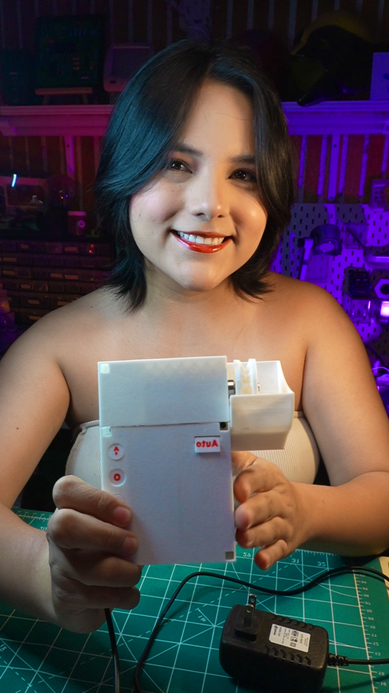

# 🪟 AutoShade — Persiana Automatizada con ESP32 + Blynk



> Control inteligente de persiana motorizada vía botones físicos y app móvil, con protección de límite mecánico y memoria persistente.

[](https://www.instagram.com/ellygmr)
[](https://www.tiktok.com/@ellygmr)
[](https://www.youtube.com/@ellygmr)
[]([https://www.facebook.com/ellygmr](https://www.facebook.com/profile.php?id=100092681746115))

---

## 📹 Video del proyecto

> 🎬 **Proximamente** — El video con la explicacion completa estara disponible en mis redes. Sigueme para no perdertelo!

---

## 🖨️ Archivos STL para impresion 3D

> 🔗 **[Descargar archivos STL en MakerWorld](https://makerworld.com/es/models/3011631-esp32-smart-blind-controller-wifi-blynk)** *DESCARGAR*

---

## ✨ ¿Que hace este sistema?

- **Control manual** — el motor sube o baja mientras se mantiene presionado el boton, fisico o desde la app.
- **Control automatico** — un toque en Auto ejecuta el ciclo completo de apertura o cierre.
- **Modo Programacion** — define cuanto dura el recorrido completo que usa Auto.
- **Modo Limite** — define el tope maximo de apertura para proteger el mecanismo y el motor.
- **Logs en tiempo real** — todo lo que sucede se refleja en el Terminal de la app Blynk.
- **Memoria persistente** — el tiempo y el limite configurados sobreviven reinicios.

---

## ⚡ Descripcion del circuito

El ESP32 DevKit es el cerebro del sistema. Lee los botones, gestiona la logica y se comunica con la app via WiFi.

El motor DC de **35 RPM a 12V** es controlado por el driver **TB6612FNG**, que actua como intermediario entre el ESP32 (3.3V) y el motor (12V). Recibe tres senales: AIN1 y AIN2 para la direccion de giro, y PWMA para la velocidad via PWM.

La alimentacion viene de una sola fuente de **12V**. El **convertidor LM2596** toma esos 12V y los reduce a 5V estables para el ESP32, eliminando la necesidad de una segunda fuente.


Fuente 12V
|
|---> VM del TB6612FNG ---> Motor DC 35RPM 12V
|
'---> LM2596 (step-down) ---> 5V ---> ESP32 DevKit
|
GPIO 25 ---> AIN1
GPIO 26 ---> AIN2
GPIO 27 ---> PWMA
GPIO 32 ---> Boton Subir
GPIO 33 ---> Boton Bajar
GPIO 12 ---> Boton Stop
GPIO 13 ---> Boton Auto
GPIO  4 ---> Buzzer

---

## 🛒 Lista de componentes y presupuesto (AliExpress 2026)

| Componente | Especificacion | USD | MXN |
|---|---|---|---|
| ESP32 DevKit V1 | WiFi + Bluetooth, dual core | $4.50 - $7.50 | $88 - $146 |
| Driver TB6612FNG | H-bridge 1.2A, hasta 15V | $0.80 - $1.50 | $16 - $29 |
| Convertidor DC-DC LM2596 | Step-down ajustable 1.5V-35V | $0.50 - $1.20 | $10 - $23 |
| Motor DC 12V 35RPM | Con reductora | $3.00 - $12.00 | $58 - $234 |
| Fuente de alimentacion 12V | Minimo 1-2A | $3.50 - $8.00 | $68 - $156 |
| 4 pulsadores | Tact switch momentaneo | $0.50 - $1.00 | $10 - $20 |
| Buzzer activo | 3-5V señal continua | $0.30 - $0.80 | $6 - $16 |
| Cables y protoboard | Conexiones y soporte | $1.50 - $3.00 | $29 - $58 |
| **TOTAL** | | **$14.60 - $35** | **$285 - $682** |

> Precios con envio estandar gratuito desde AliExpress. Tipo de cambio: ~$19.50 MXN/USD.

---

## 📱 Pines virtuales Blynk

| Pin | Widget | Modo | Funcion |
|---|---|---|---|
| V0 | Button | Switch | Abrir (subir) |
| V1 | Button | Switch | Cerrar (bajar) |
| V2 | Button | Push | Stop / configuracion |
| V3 | Button | Push | Auto ciclo completo |
| V4 | Terminal | - | Log en tiempo real |

---

## 🎮 Modos especiales (boton Stop)

| Accion | Resultado |
|---|---|
| 1 toque | Detiene el motor |
| 2 toques rapidos (menos de 1 seg) | Entra a modo Limite |
| 3 toques rapidos (menos de 1 seg) | Entra a modo Programacion |
| Mantener 3 segundos (fisico) | Entra a modo Programacion |
| 1 toque dentro de un modo | Guarda y sale |

---

105 ## 📁 Estructura del repositorio

```text
Persiana-Automatizada-esp32/
|
|-- Codigo/
|   '-- persiana_esp32.ino
|
|-- Diagrama/
|   '-- Persiana_bb.png
|
|-- images/
|   |-- portada.jpg
|   '-- instalacion_01.jpg
|
|-- README.md
|-- manual_persiana.pdf
'-- manual_blynk_persiana.pdf
```
123
124  ---


## 🔧 Instalacion rapida

1. Instala **Arduino IDE** con soporte para ESP32 core 3.x
2. Instala la libreria **Blynk** desde el Gestor de Librerias
3. Crea un Template en [blynk.cloud](https://blynk.cloud) con los pines V0 a V4
4. Edita las primeras lineas del codigo:

```cpp
#define BLYNK_TEMPLATE_ID   "TMPLxxxxxx"
#define BLYNK_TEMPLATE_NAME "Persiana"
#define BLYNK_AUTH_TOKEN    "xxxxxxxxxxxx"
char ssid[] = "TU_RED_WIFI";
char pass[] = "TU_CONTRASEÑA";
```

5. Carga al ESP32 y sigue el `manual_blynk_persiana.pdf`

---

## 📚 Documentacion incluida

| Archivo | Contenido |
|---|---|
| manual_persiana.pdf | Uso completo: botones, Programacion y Limite |
| manual_blynk_persiana.pdf | Configuracion de Blynk Cloud y la app movil |

---

## 🤝 Creditos

Proyecto por **@ellygmr**. Gracias a la comunidad maker y a **Bambu Lab**.

Si lo construyes, ¡etiquetame en mis redes!

[](https://www.instagram.com/ellygmr)
[](https://www.tiktok.com/@ellygmr)
[](https://www.youtube.com/@ellygmr)
[]([https://www.facebook.com/ellygmr](https://www.facebook.com/profile.php?id=100092681746115))

